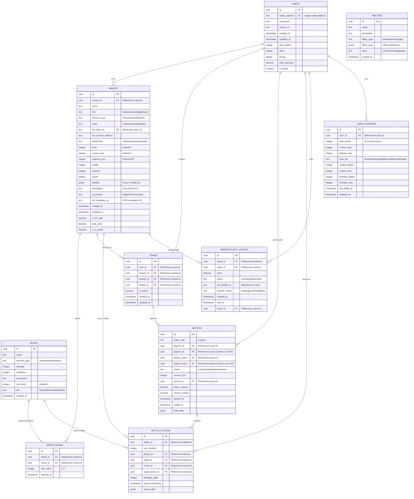
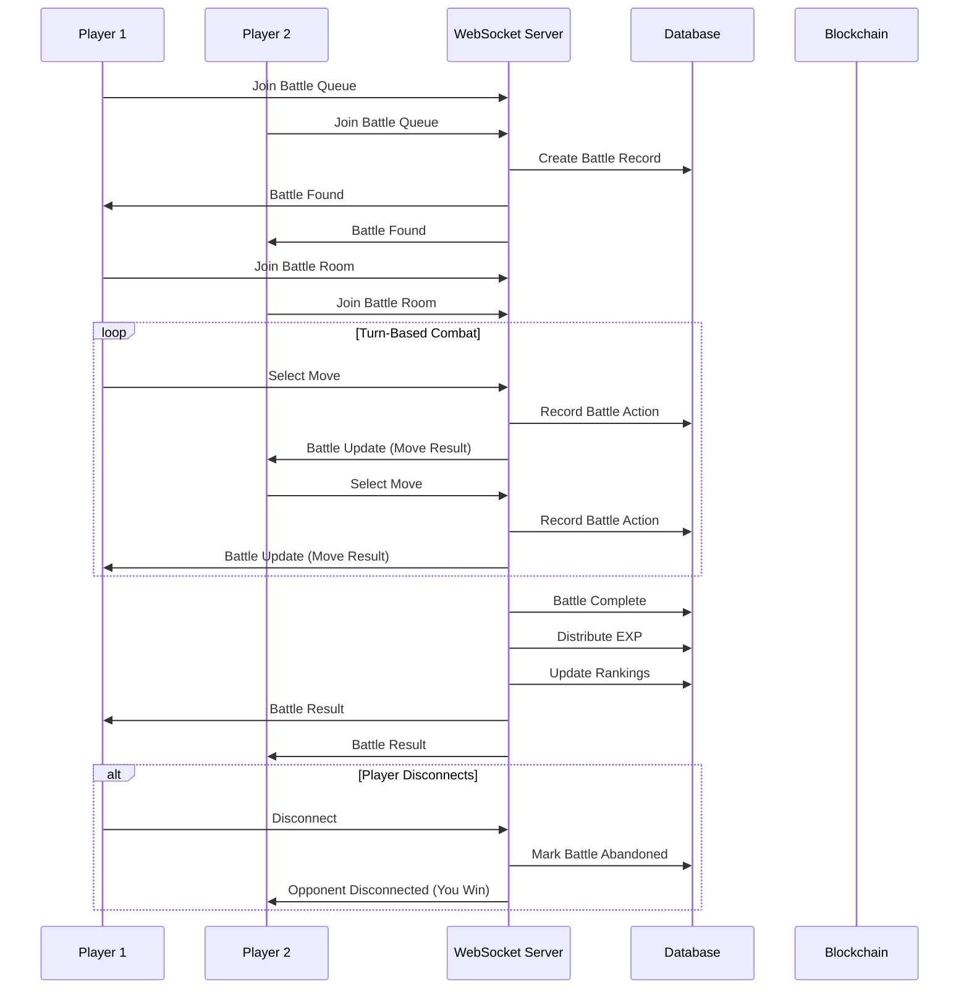
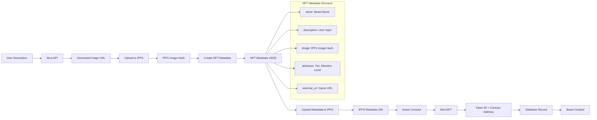
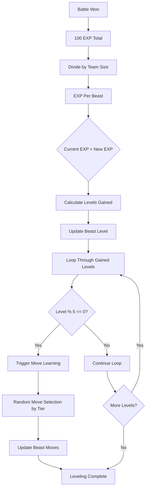
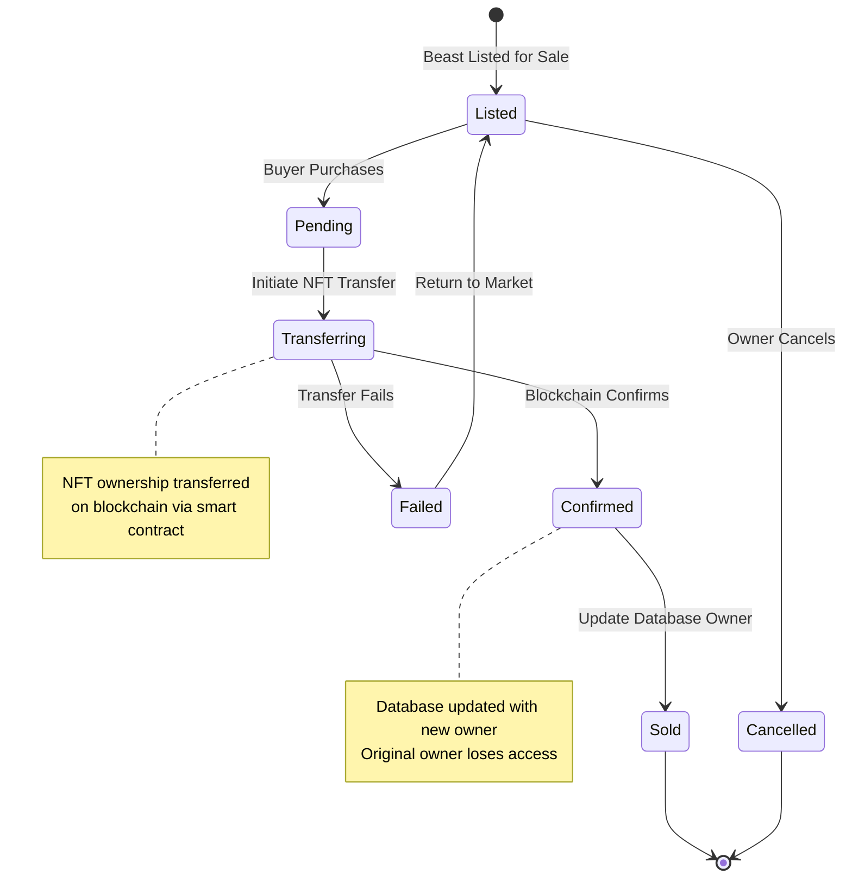

# 🗄️ Battle Beasts - Database Architecture & System Diagrams

## 📊 **DATABASE ENTITY RELATIONSHIP DIAGRAM**

## 🔄 **SYSTEM FLOW DIAGRAM**

```mermaid
flowchart TD
    A[User Connects Wallet] --> B[Create Account in DB]
    B --> C[Beast Creation Flow]
    
    C --> D[User Inputs Description]
    D --> E[fal.ai Generates Image]
    E --> F[Upload Image to IPFS]
    F --> G[Create NFT Metadata]
    G --> H[Upload Metadata to IPFS]
    H --> I[Mint NFT on Blockchain]
    I --> J[Save Beast to Database]
    J --> K[Assign Random Abilities]
    
    K --> L[Team Management]
    L --> M[Select 3 Beasts for Team]
    M --> N[Battle System]
    
    N --> O{Battle Type?}
    O -->|PvP| P[Find Opponent]
    O -->|PvE| Q[Generate AI Opponent]
    
    P --> R[Deduct WAM Stake]
    Q --> R
    R --> S[Create Battle Record]
    S --> T[WebSocket Battle Room]
    
    T --> U[Turn-Based Combat]
    U --> V[Record Battle Actions]
    V --> W{Battle Complete?}
    W -->|No| U
    W -->|Yes| X[Determine Winner]
    
    X --> Y[Distribute 100 EXP]
    Y --> Z[Update Rankings ELO]
    Z --> AA{Level Up?}
    AA -->|Yes| BB[Check Move Learning]
    AA -->|No| CC[Battle Complete]
    BB --> DD{Level % 5 == 0?}
    DD -->|Yes| EE[Trigger Move Selection]
    DD -->|No| CC
    EE --> CC
    
    CC --> FF[Marketplace]
    FF --> GG[List Beast for Sale]
    GG --> HH[Transfer NFT Ownership]
    HH --> II[Update Database Owner]
```

## 🏗️ **BATTLE SYSTEM ARCHITECTURE**

## 🎨 **NFT CREATION FLOW**

## 📈 **EXP & LEVELING SYSTEM**

## 🏪 **MARKETPLACE & NFT TRANSFER**

## 🔗 **KEY RELATIONSHIPS EXPLAINED**

### **1. User → Beast Ownership**
- **One-to-Many**: Each user can own multiple beasts
- **NFT Integration**: Ownership verified on blockchain
- **Database Sync**: `beasts.owner_id` references `users.id`

### **2. Beast → Moves Learning**
- **Many-to-Many**: Each beast can learn multiple moves, each move can be learned by multiple beasts
- **Junction Table**: `beast_moves` with `slot_index` (0-3)
- **Level Restriction**: Moves have `min_level` requirements

### **3. Team Composition**
- **Fixed Structure**: Exactly 3 beasts per team
- **User Ownership**: All team beasts must belong to the same user
- **Battle Ready**: Teams used in battle system

### **4. Battle System**
- **Player Participation**: 1-2 players (PvE has NULL player2)
- **Team Assignment**: Each player brings their active team
- **Action Logging**: All moves recorded in `battle_actions`

### **5. Marketplace Transfers**
- **NFT-Based**: Actual blockchain ownership transfer
- **Status Tracking**: Pending → Confirmed → Complete
- **Database Update**: Owner changes after blockchain confirmation

### **6. Ranking System**
- **ELO Algorithm**: Points gained/lost based on opponent strength
- **Dynamic Ranks**: Recalculated after each battle
- **Tier System**: Bronze → Silver → Gold → Platinum → Diamond → Master

## 🚀 **IMPLEMENTATION CHECKLIST**

- [ ] **Phase 1**: Core tables (users, beasts, moves, abilities)
- [ ] **Phase 2**: Battle system (battles, battle_actions, teams)
- [ ] **Phase 3**: Economy (marketplace_listings, user_rankings)
- [ ] **Phase 4**: Indexes and optimization
- [ ] **Phase 5**: WebSocket integration
- [ ] **Phase 6**: NFT smart contracts
- [ ] **Phase 7**: fal.ai + IPFS integration

**Total Tables**: 10 tables with 15+ foreign key relationships
**External Integrations**: fal.ai, IPFS, Blockchain, WebSockets
**Real-time Features**: Battle updates, ranking changes, marketplace activity